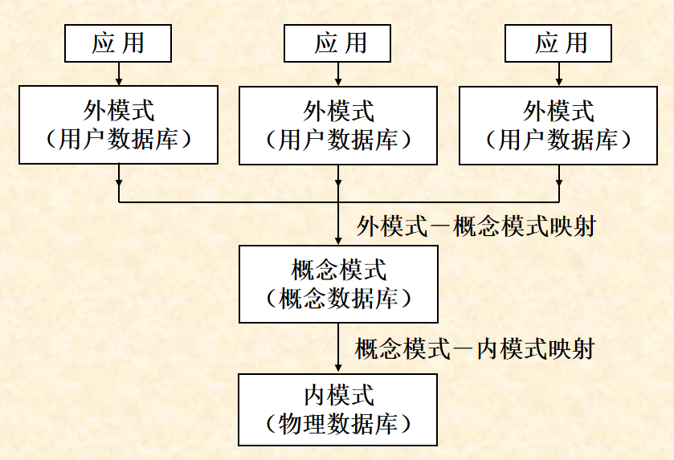
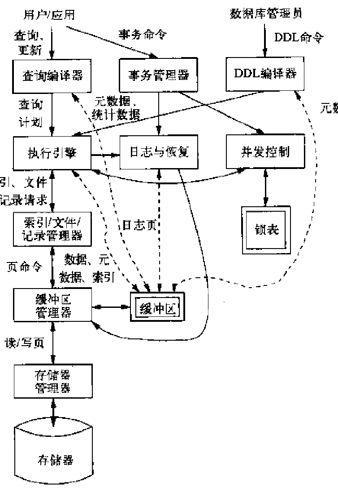

# 第一章 数据库系统概述

## 1. 基本概念

### 1. **数据库**

    是数据集合，具有统一的结构形式并存放于统一的存储介质内，由多种应用数据集成，并可被应用所共享

### 2. **数据库管理系统**

一种管理数据库的系统软件，是数据库的应用程序与数据库的接口，在保证数据安全、可靠的同时，提高数据库应用时的简明性和方便性
> 功能：
    数据组织：数据模式定义，数据存取的物理操作
    数据操纵
    数据维护
    数据控制及保护
    数据交换
    数据服务
    数据字典

### 3. **数据子语言**

**SQL语言:**
> 数据定义语言(DDL)：数据模式定义 & 数据物理存取
> 数据操纵语言(DML)：数据操纵(查询，增删改)
> 数据控制语言(DCL)：数据完整性、安全性的定义与检查以及并发控制、故障恢复等

使用方式: 交互式命令语言, 宿主型语言

### 4. 数据库系统

组成部分：数据库、数据库管理系统、数据库管理员、软件平台、硬件平台

### 5. 数据库应用系统

组成：数据库系统、应用软件、应用界面、用户
> **层次结构：**
    硬件平台 $\rightarrow$ 操作系统 $\rightarrow$ 数据 $\rightarrow$ 数据库管理系统 $\rightarrow$ 数据交换与中间件 $\rightarrow$ 开发工具 $\rightarrow$ 应用软件 $\rightarrow$ 应用界面 $\rightarrow$ 用户

### 6. 数据库用户

最终用户：终端查询用户、应用程序使用者；应用程序开发人员；数据库管理员

## 2. 数据库系统的发展及趋势

发展阶段：人工管理 $\rightarrow$ 文件系统管理 $\rightarrow$ **数据库系统管理**

### 通用数据库系统

> 面向对象数据库系统
> 知识库系统
> **关系数据库系统扩充**

## 3. 数据库系统的基本特点

### 1. 集成性

    > 采用统一的数据结构
    > 建立一个全局统一的数据模式
    > 根据每个应用的数据需要构造局部模式

### 2. 高共享性与低冗余性

减少不必要的存储空间，避免**数据的不一致性**

### 3. 独立性

    > 物理独立性
        物理结构(存储结构、存取方式等)改变不影响数据库逻辑结构，不引起应用程序变化
    > 逻辑独立性
        逻辑结构改变(修改数据模式、增加新数据类型、改变数据间联系等)不需要修改应用程序

### 4. 数据统一管理与控制

    > 数据完整性检查
    > 数据安全性保护
    > 并发控制
    > 数据库故障恢复

## 4. 数据库内部结构体系

### 数据库系统的三级模式

> **概念模式**(简称模式)
> **外模式**(子模式，用户模式)
> **内模式**(物理模式)

三级模式两种映射关系图

#### 1. 概念模式

关于整个数据库中数据**全局逻辑结构**的描述

面向数据库系统，以某种数据类型为基础，描述：
> 数据的类型、长度、特征
> 数据间的联系
> 安全性、完整性等方面的要求

#### 2. 外模式(子模式、用户模式)

描述关于某个用户所需数据的逻辑结构，可由概念模式推导而出，是概念模式的一个子集
> 一个概念模式可对应多个外模式
> 用户只通过外模式使用数据库，可：
> **简化用户接口，便于使用**
> **降低数据冗余度**
> **利于数据安全性保护和保密**

#### 3. 内模式(物理模式)

描述数据库中数据的物理存储结构和物理存取方法

#### 三个层次的数据库概念

**—概念数据库**
**—用户数据库**
**—物理数据库**
> 只有物理数据库真实存在于计算机外存

### 数据库系统的两级映射

**概念模式到内模式的映射**
给出了概念模式中数据的**全局逻辑结构**到数据的**物理存储结构**间的对应关系，此种映射一般由DBMS实现
可实现物理独立性
**外模式到概念模式的映射**
概念模式是一个全局模式，而外模式则是用户的局部模式。一个概念模式中可以定义多个外模式，而每个外模式是概念模式的一个基本**视图**
外模式到概念模式的映射给出了外模式与概念模式的对应关系，这种映射一般也由DBMS实现
可实现逻辑独立性

两级映射建立了三级模式间的联系与转换，保证数据独立性

